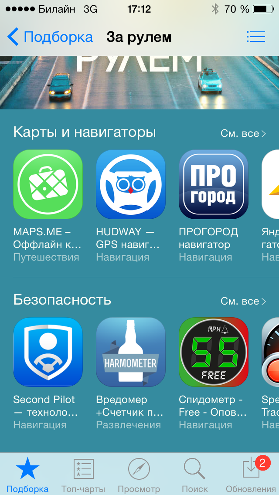
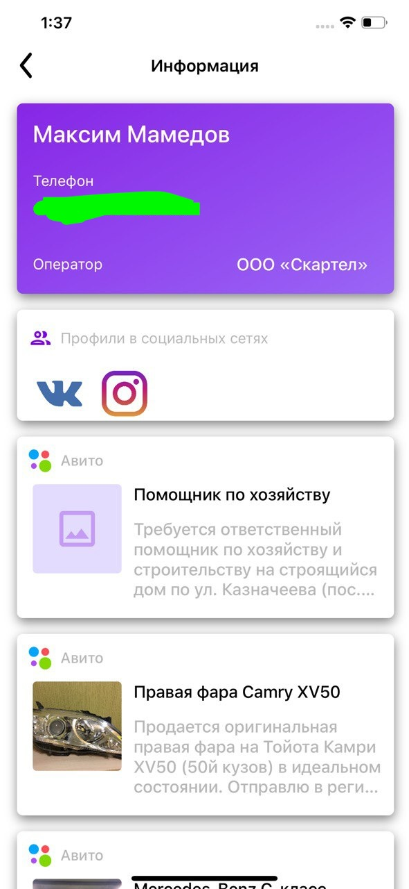


Проекты, в создании которых я принимал участие 🧑‍💻


## Мои

Данные проекты были придуманы и сделаны либо внутри [MAD Studio](https://wearemadstudio.com) за свои деньги, либо в соло.

### Активные
* [byAir](https://byairapp.com) (зима 2023 – текущий момент)
* [Dirty Weather](https://dirtyweather.top) (2016 – текущий момент)
* [Hookah Mixer](https://hookahmixer.com) (2017 – текущий момент)
* [Nomad VPN](https://t.me/nomad_vpn_bot) (апрель 2022 – текущий момент)

### Заброшенные

* **Harmometer/Вредомер.** В свое время проект попал в подборку App Store:

* **NumberInfo.** По номеру телефона выдавалась вся публично (и не очень) доступная информация о человеке – профиль ВК, в Instagram. С обновлением политики App Store (приватность) обновлять проект стало невозможно.

* **Угадай Авто.** Простая "угадывалка" со встроенной рекламой. Из-за отсутствия серьезной конкуренции на рынке в моменте существования приложения (2014-2015 год) оно было довольно популярным и приносило около 300$ в месяц, что для студента было пределом мечтаний.
* **Помощник студента ВПИ.** Позволял смотреть расписание своей группы, вести дневник/заметки и кучу других функций. 10 лет назад для ВУЗа в городке на 300к населения это было круто!


## Не мои

Эти проекты были сделаны за деньги. Тут оставлю только то, что до сих пор живо и не стыдно показать.

* [iMe Messenger](https://imem.app/) (осень 2020 – текущий момент)
* [OXY.chat](https://oxy.chat/) (зима 2021 – текущий момент)
* [Fieldwork HQ](https://fieldworkhq.com/) – [new iOS app](https://apps.apple.com/vn/app/fieldwork-office/id1456789608) (зима 2018 – текущий момент)
* [Mobile.UniCredit](https://apps.apple.com/ru/app/%D1%8E%D0%BD%D0%B8%D0%BA%D1%80%D0%B5%D0%B4%D0%B8%D1%82-%D0%B1%D0%B0%D0%BD%D0%BA/id1486800854) (март 2019 – август 2020)
* [Кинопоиск iOS](https://apps.apple.com/ru/app/%D0%BA%D0%B8%D0%BD%D0%BE%D0%BF%D0%BE%D0%B8%D1%81%D0%BA-%D1%84%D0%B8%D0%BB%D1%8C%D0%BC%D1%8B-%D0%B8-%D1%81%D0%B5%D1%80%D0%B8%D0%B0%D0%BB%D1%8B/id477718890) (август 2019 – октябрь 2020)
